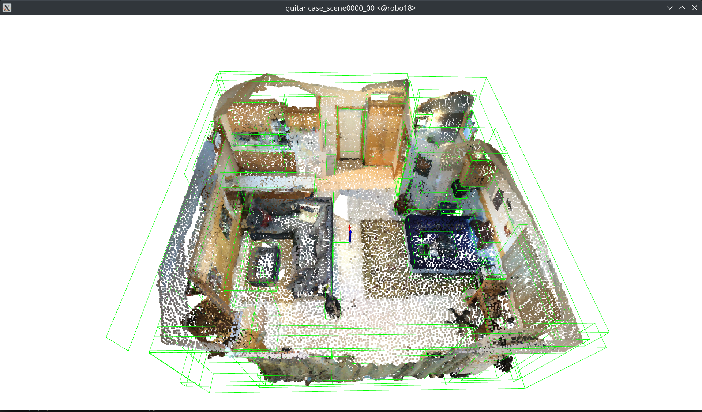

# Learning Context-Aware 3D Scene Representations with Graph Autoencoders

## Introduction

This project explores context-aware 3D scene representation learning using graph autoencoders (GAEs). A GNN-based autoencoder is developed to learn object embeddings that capture both geometric and semantic relationships within 3D scene graphs. To enhance representation quality, the model is encouraged to encode the neighborhood context of each object into its embedding. Inspired by NWR-GAE and the InfoMax principle, an optimal transport loss is employed to align the feature distribution of the neighborhood with the distribution reconstructed from the embedding via MLP decoder. This design enables self-supervised pretraining to gain task-agnostic embeddings with contextual awareness. As a proof of concept, the approach is evaluated using a 3D visual grounding decoder, achieving 58.2% accuracy on the NR3D dataset and demonstrating strong potential for state-of-the-art performance with full-scale training and optimization.



### Results

3D Visual Grounding is the task of locating the 3D object in a scene that corresponds to a given natural-language description. The approach is evaluated by measuring the 3D Visual Grounding accuracy (Acc) on the NR3D test split, assuming ground-truth bounding boxes are available (following BUTD-DETR, ECCV 2022):

|                                        Model                                        | Acc (training on NR3D train split) | Acc (training on large-scale datasets) |
| :---------------------------------------------------------------------------------: | :--------------------------------: | :------------------------------------: |
|                                BUTD-DETR (ECCV 2022)                                |                ---                 |                  54.6                  |
|                                3D-ViSTA (ICCV 2023)                                 |                57.5                |                  64.2                  |
| Transformer with GNN encoder, self-supervised pretraining, unfrozen after 10 epochs |                58.2                |                  ---                   |
|                                  PQ3D (ECCV 2024)                                   |                64.9                |                  66.7                  |

|                                      Ablation                                       | Visual Grounding Accuracy |
| :---------------------------------------------------------------------------------: | :-----------------------: |
|                           Transformer without GNN encoder                           |           38.2            |
|                 Transformer with GNN encoder and spatial attention                  |           37.8            |
|                            Transformer with GNN encoder                             |           54.3            |
|              Transformer with GNN, self-supervised pretraining, frozen              |           46.7            |
| Transformer with GNN encoder, self-supervised pretraining, unfrozen after 10 epochs |           58.2            |

Note: In all of the above approaches, models are initialized using pretrained weights for language and point cloud encoders. Both our approach and PQ3D assume that ground-truth object labels are available.

## Repository structure

Code and plots can be found in the [jupyter notebook](notebooks/explore_visual_gounding.ipynb).

Note: This repository contains code from my [pytorch project template](https://github.com/bertan-karacora/pytorch-project-template). I started working in a Jupyter notebook, added the full package-style repository structure at some point, but ended the project before I made the full switch, so the most of the code in the notebook is redundant and could be replaced by just a few imports.

## Setup

```bash
git clone https://github.com/bertan-karacora/3d-visual-grounding-gae.git
cd 3d-visual-grounding-gae
```

Download and prepare the NR3D and Scannet dataset. Note that these datasets are not immediately accessible. Therefore, we used the [Sceneverse dataset](https://github.com/scene-verse/SceneVerse) instead. Besides a lot of other scenes and annotations, the Sceneverse dataset contains all the scenes from Scannet and the annotations from NR3D.

## Installation

Configure your setup using `env.sh`, specifying the desired versions of Ubuntu, CUDA, CudNN, Python, Pip, Setuptools and Wheel.

### Local

You can setup your local system directly if you have sudo rights.

```bash
./setup.sh
```

```bash
rm -rf *.egg-info
pip install --editable .
```

### Build container

Alternatively, use a container (recommended).

```bash
container/build.sh
```

## Usage

### Local

Start a jupyter session and open the 

### Run in container

```bash
container/run.sh
```

You may provide any command including arguments directly, e.g.:

```bash
container/run.sh echo "test" && scripts/start_jupyter.sh
```
